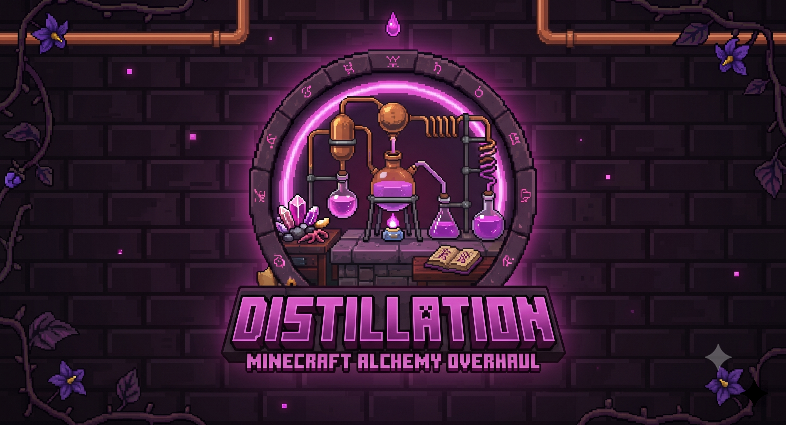

<p align="center">
  
</p>

<p align="center"><strong>Every drop counts.</strong></p>

<p align="center">
  <a href="https://www.minecraft.net/"></a>
  <a href="https://fabricmc.net/"></a>
  <a href="LICENSE"></a>
  <a href="https://github.com/rfizzle/distillation/actions/workflows/ci.yml"></a>
</p>

Distillation makes brewing a system you learn by playing. The stand teaches its own
recipes through vapor hints and failures that name a working ingredient; the vanilla
effects that shipped without recipes become brewable; a heated cauldron scales a recipe
you have learned to six bottles at once; utility potions get honest durations with
half-drinkable draughts; and antidotes cure one affliction at a time.

Everything brews from items vanilla already ships — no new crops, ores, mobs, or
dimensions, and no vanilla recipe is taken away.

## Download

| [Modrinth](https://modrinth.com/mod/distillation-alchemy-overhaul) | [CurseForge](https://www.curseforge.com/minecraft/mc-mods/distillation-alchemy-overhaul) | [GitHub Releases](https://github.com/rfizzle/distillation/releases) | [Website](https://distillation.rfizzle.com) | [Report an issue](https://github.com/rfizzle/distillation/issues) |
| --- | --- | --- | --- | --- |

---

## Features

### Brew by discovery

Hold an ingredient over the stand's ingredient slot and the vapor clouds with a **color
hint** of what it would become; once you know the recipe, the hint names the output
outright. A failed combination bottles a **Murky Draught** whose tooltip names one
ingredient that *would* have worked with that base — drink it for fifteen seconds of
nausea and a twenty-second taste of the potion it wanted to be.

Every brew you take is written permanently into a **recipes page inside the brewing
screen**, with a running count that gilds when the graph is complete. Discovery is per
player and survives death and relog, and any recipe you know can be copied onto paper as
a **Recipe Note** — a tradeable, giftable card that still asks its reader to brew the
thing once themselves.

### The missing brews

Every vanilla effect that shipped without a recipe becomes brewable:

| Effect | Recipe | Base | + Redstone | + Glowstone |
|---|---|---|---|---|
| Resistance | Awkward + Shulker Shell | 3:00 | 8:00 | II · 1:30 |
| Haste | Swiftness + Honey Bottle | 8:00 | 20:00 | II · 4:00 |
| Absorption | Awkward + Golden Apple | 3:00 | 8:00 | II · 1:30 |
| Luck | Awkward + Nautilus Shell | 8:00 | 20:00 | — |
| Glowing | Awkward + Glow Ink Sac | 3:00 | 8:00 | — |
| Levitation | Awkward + Chorus Fruit | 0:30 | 1:00 | — |
| Health Boost | Awkward + Pumpkin Pie | 3:00 | 8:00 | II · 1:30 |

Fermented spider eye completes the inversion table alongside them — Haste to Mining
Fatigue, Luck to Bad Luck, Glowing to Invisibility, Slow Falling to Levitation, and the
vanilla pairs. Vanilla's two dead-end bottles get jobs too: Mundane ferments into
Weakness, and the Thick Potion becomes the base every antidote starts from.

### Batch brewing

Stand your brewing stand on a **water cauldron heated from below** — a lit campfire,
soul campfire, fire, soul fire, lava source, or magma block — and a second row of three
bottle slots appears. Brewing a recipe **you have already discovered** fills all six
bottles in one 400-tick cycle for **3 ingredients** where the same six bottles over two
ordinary passes would cost 2, plus **2 fuel charges** and **1 cauldron water level**.

The shortcut stays earned. Undiscovered recipes still brew three at a time, batch-row
bottles whose recipe the stand's owner has not learned are skipped untouched rather than
murked, and hoppers can neither see nor fill the batch row — so an automated stand never
batch-brews.

### Honest durations and draughts

Fire Resistance, Water Breathing, Night Vision, and Invisibility base at **8:00** instead
of 3:00 (20:00 extended); Slow Falling gets 4:00. Combat potions keep their vanilla
timers.

**Sneak-drink to sip half** — four minutes of an eight-minute potion now, and the bottle
stays as a stoppered half for later. A half goes down in half the drink time, which is a
swallow you can afford mid-fight. **Re-drinking** a brew that is still running adds the
fresh dose to what is left instead of resetting it, capped at twice the base duration.

### Concentrated and premium brews

Redstone and glowstone stop being mutually exclusive. Brew a potion's own reagent onto
it a second time — two blaze powder in total, for Strength — and the **Concentrated**
result accepts *both* dusts, in either order, for a brew that is extended **and**
amplified: Strength II for 4:00, rather than choosing between II at 1:30 and I at 8:00.
On an ordinary potion the dusts behave exactly as vanilla, and only effects with a
level II form can be concentrated.

### Antidotes

Eight surgical cures, each brewed from a **Thick Potion** and the affliction's own
source:

| Antidote | Thick + | Cures |
|---|---|---|
| Poison Antidote | Fermented Spider Eye | Poison |
| Wither Antidote | Wither Rose | Wither |
| Mining Fatigue Antidote | Prismarine Crystals | Mining Fatigue |
| Blindness Antidote | Ink Sac | Blindness |
| Darkness Antidote | Echo Shard | Darkness |
| Levitation Antidote | Popped Chorus Fruit | Levitation |
| Slowness Antidote | Sugar | Slowness |
| Weakness Antidote | Blaze Powder | Weakness |

Each strips exactly one effect and nothing else, so your buffs survive the cure. Milk is
untouched and still clears everything. Antidotes throw as splash and lingering.

### Splash, lingering, and tipped arrows

Lingering clouds last **60 seconds** at a **4½-block** starting radius; splash applies a
flat **87.5%** of the drinkable duration, with no distance falloff. A **beneficial**
splash or cloud you throw is attuned to your side — it buffs players and their pets and
passes over the hostiles standing in it — while harmful brews stay grenades for
everyone.

Right-click a water cauldron with a **discovered** drinkable potion to charge it, then
dip arrows to tip **eight at a time**, one water level per dip. Vanilla's lingering-potion
tipping recipe still works untouched.

### The flask

A copper-and-glass vessel holding **three doses of one discovered brew**, refillable
forever. Fill it by pouring a bottled potion in (flask in the off hand, bottle in the
main hand — you get the empty glass bottle back) or from a batch pass, with a flask
sitting in a batch-row slot. Drink a dose at a time, or sneak to sip a half. One brew at
a time, never mixed, and a Murky Draught never enters one.

### The stand talks to redstone

A comparator against any brewing stand reads **brew state** rather than container
fullness: zero when idle and empty, a low band while a cycle runs — where the value is
the bottle count, up to six on a rigged batch — and a high band once the bottles are
done.

### Advancements

Seven entries hang under vanilla's **Local Brewery**: Trial and Error (bottle a Murky
Draught), Scholar of the Still (discover ten recipes), The Missing Shelf (brew every
missing effect line), Round for the Table (complete a six-bottle batch), Surgical (strip
one effect with an antidote while keeping two others), The Good Stuff (brew a premium
potion), and Every Drop (discover the entire graph).

---

## Installation

**Requirements:** Minecraft 1.21.1, Fabric Loader 0.16.10+, Fabric API, Java 21

1. Install [Fabric Loader](https://fabricmc.net/use/) for 1.21.1.
2. Drop [Fabric API](https://modrinth.com/mod/fabric-api) into `mods/`.
3. Drop `distillation-<version>.jar` into `mods/` as well.

Distillation goes on **both** the server and every client — the brewing itself is
server-side, while the recipes page, vapor hints, and potion tooltips are not.
Optionally add [Mod Menu](https://modrinth.com/mod/modmenu) and
[Cloth Config](https://modrinth.com/mod/cloth-config) for the in-game settings screen.

## Commands

| Command | Permission | What it does |
|---|---|---|
| `/distillation recipes` | 0 | Your discovery count and five most recent recipes |
| `/distillation recipes <player>` | 2 | The same report for another player |
| `/distillation discover <recipe\|all> [player]` | 2 | Grants a discovery |
| `/distillation forget <recipe\|all> [player]` | 2 | Removes discoveries |
| `/distillation rig` | 0 | Batch-rig status of the stand you are looking at |
| `/distillation reload` | 2 | Reloads the config and rebuilds the recipe graph |

## Configuration

Config generates at `config/distillation.json` on first launch, and every feature is
independently toggleable — from Mod Menu / Cloth Config, or by hand. `/distillation
reload` applies changes without a restart and rebuilds the recipe graph.

Server-authoritative keys cover each system (`enableDiscovery`, `enableMissingBrews`,
`enableBatchBrewing`, `enableHonestDurations`, `enableDraughts`, `enableFlask`,
`enablePremiumBrews`, `enableAntidotes`, `enableThrownRebalance`, `enableAttunedSplash`,
`enableComparatorOutput`, `enableTippedArrows`, …) alongside the tuning numbers
(`batchIngredientCost`, `batchFuelCost`, `tippedArrowsPerDip`, `splashDurationFactor`,
`lingeringCloudDurationTicks`, `lingeringCloudRadius`). Three keys are client-only and
never synced: `showVaporHints`, `recipeViewerShowsUndiscovered`, and
`smoothNightVisionFade`. An out-of-range value is clamped with a warning in the log
rather than rejected.

Distillation registers no keybinds and claims no HUD space — by design.

## Optional integrations

All soft, all optional, none of them required:

- **Mod Menu** + **Cloth Config** — the in-game settings screen
- **Jade** / **WTHIT** — brew progress, batch-rig status and owner on the stand, and the
  heat line on the cauldron below
- **EMI** / **REI** / **JEI** — a brewing recipe category that lists only what you have
  discovered (turn on `recipeViewerShowsUndiscovered` to see the rest)

---

## For Mod Developers

Distillation exposes a stable, read-only API and two server-side events in
`com.rfizzle.distillation.api`, following the
[Concord API Standard](https://github.com/rfizzle/concord/blob/master/API-STANDARD.md).
Use it as a soft dependency: compile against the mod with `modCompileOnly` and guard
every call with `FabricLoader.isModLoaded("distillation")`. Everything outside the `api`
package is internal and may change in any release.

**The stable surface**

- `DistillationAPI.isDiscovered(ServerPlayer, ResourceLocation)` — whether that player
  has discovered that recipe
- `DistillationAPI.getDiscoveredRecipes(ServerPlayer)` — an immutable copy of the
  player's discovered recipe ids
- `DistillationAPI.getRecipeIds()` — every recipe id in the live graph; empty when no
  server is running
- `DistillationAPI.registerAntidote(ResourceLocation effectId, Ingredient reagent)` — the
  one sanctioned mutation: adds a Thick-based antidote line curing `effectId` from
  `reagent`. Returns `false` and changes nothing if that effect already has an antidote
  or names no registered effect
- `DistillationBrewCallback` — fires server-side once per completed brewing cycle,
  normal or batch
- `DistillationDiscoveryCallback` — fires server-side the first time a player discovers
  a recipe through play

Deliberately absent: no HUD accessors (Distillation holds no HUD slot, so a sibling's
stacking sum treats it as absent), no discovery mutators (discovery is earned gameplay
state, and the commands are the admin path), and no brew-result mutation — register a
real conversion instead, and the recipe graph absorbs it.

### Gradle setup

```gradle
repositories {
    // Sibling jars resolve from GitHub Releases through an artifact-only `rfizzle:` ivy
    // repo while the Modrinth projects are not publicly resolvable. See API-STANDARD §4.
    ivy {
        name = 'GitHubReleases'
        url = 'https://github.com'
        patternLayout {
            artifact '/[organisation]/[module]/releases/download/v[revision]/[module]-[revision].jar'
        }
        metadataSources { artifact() }
        content { includeGroup 'rfizzle' }
    }
}

dependencies {
    modCompileOnly "rfizzle:distillation:<version>"
}
```

Add `"distillation": "*"` under `suggests` in your `fabric.mod.json` — never `depends`,
and never a version floor.

### Usage examples

**Adding an antidote line for your own affliction.** Call it from `onInitialize`: the
recipe graph is built after every registration, so a line added there participates in
discovery, vapor hints, batching, and the recipe viewers exactly like a native one.

```java
if (FabricLoader.getInstance().isModLoaded("distillation")) {
    com.rfizzle.distillation.api.DistillationAPI.registerAntidote(
            ResourceLocation.fromNamespaceAndPath("yourmod", "your_affliction"),
            Ingredient.of(YourItems.YOUR_REAGENT));
}
```

**Reacting to a first-time discovery.** Fires only for discovery earned through play —
`/distillation discover` and the `startDiscovered` join grant record silently.

```java
if (FabricLoader.getInstance().isModLoaded("distillation")) {
    com.rfizzle.distillation.api.DistillationDiscoveryCallback.EVENT.register((player, recipeId) -> {
        // once, the first time this player discovers this recipe
    });
}
```

**Observing completed brews.** `results` is an immutable snapshot — observe it, never
mutate or retain it. `batchOwner` is `null` for a normal three-bottle pass.

```java
if (FabricLoader.getInstance().isModLoaded("distillation")) {
    com.rfizzle.distillation.api.DistillationBrewCallback.EVENT.register(
            (level, pos, ingredient, results, batchOwner, batch) -> {
                // one call per completed cycle, batch or not
            });
}
```

**Reading a player's progress.**

```java
if (FabricLoader.getInstance().isModLoaded("distillation")) {
    boolean known = com.rfizzle.distillation.api.DistillationAPI.isDiscovered(serverPlayer, recipeId);
    int discovered = com.rfizzle.distillation.api.DistillationAPI.getDiscoveredRecipes(serverPlayer).size();
    int total = com.rfizzle.distillation.api.DistillationAPI.getRecipeIds().size();
}
```

Both events isolate their listeners per guest inside the invoker: a listener that throws
is logged once at `WARN` and skipped, rather than taking the brew down with it.

---

## Building from source

```bash
make build        # compile, run unit tests, assemble the jar
make test         # JUnit only
make coverage     # unit tests + gametests, merged JaCoCo report
make run-client   # dev client
make run-datagen  # regenerate src/main/generated
./gradlew runGametest
```

Requires JDK 21. [`AGENTS.md`](AGENTS.md) is the contributor guide; the player promise
lives in [`design/VISION.md`](design/VISION.md), the behavioral contract in
[`design/SPEC.md`](design/SPEC.md), and the brand in
[`design/DESIGN.md`](design/DESIGN.md).

---

## Part of Concord

Part of [Concord](https://github.com/rfizzle/concord) — a modular collection of system
overhauls. Install any, combine all.

- [Tribulation](https://tribulation.rfizzle.com) — Survive what comes next.
- [Mercantile](https://mercantile.rfizzle.com) — Every villager remembers.
- [Prosperity](https://prosperity.rfizzle.com) — Every chest, yours to discover.
- [Meridian](https://meridian.rfizzle.com) — Chart your enchantments.

With none of them installed, nothing here is missing.

---

## License

Licensed under the [MIT License](LICENSE). © 2026 rfizzle. Distillation is not
affiliated with Mojang Studios or Microsoft.
